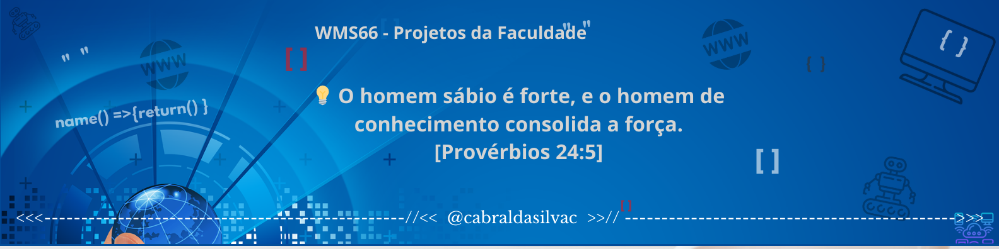

 
 

-   🔥 Graduado em  Análise e Desenvolvimento de Sistemas na Faculdade Descomplica. 
-   🔥 Pós-Graduando em Desenvolvimento FullStack na Faculdade Descomplica. 
-   💬 Pergunte-me sobre. **JavaScript, HTML, CSS, SQL, Node.JS, Python, Java, DevOps**
-   👨‍💻 Saiba mais sobre a minha jornada na Faculdade. [Clique aqui!](https://website-red-eight.vercel.app/)

 

    

        <h2>🛠 &nbsp;Tech Stack</h2>

&nbsp;
&nbsp;
&nbsp;
&nbsp;
&nbsp;
&nbsp;
&nbsp;
&nbsp;
&nbsp;
&nbsp;
&nbsp;
&nbsp;
&nbsp;
&nbsp;

### Posts

 <!-- BLOG-POST-LIST:START -->
 
<!-- BLOG-POST-LIST:END -->

